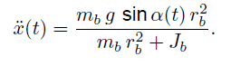
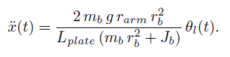
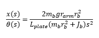
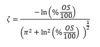
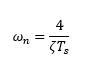
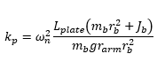
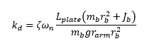
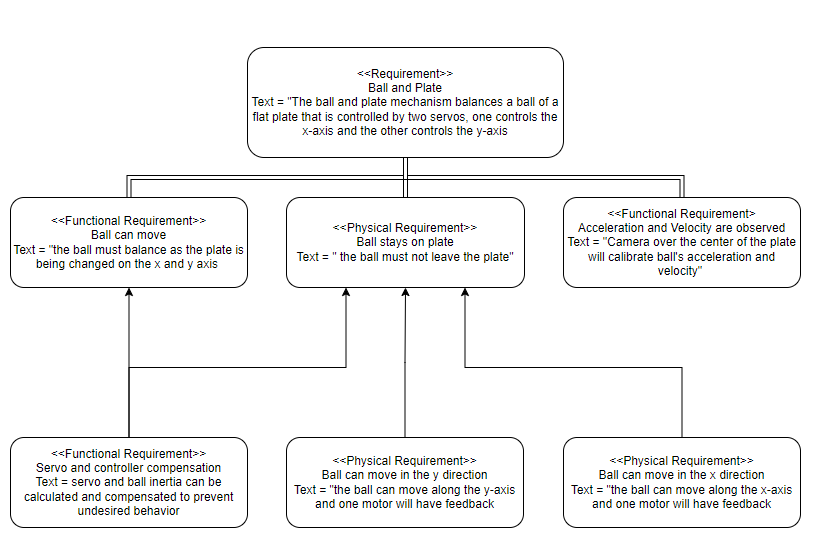

# Ball-On-Plate
## MECA 482 - Control Systems Design Project

<b>Project Members: 
  

</b> Ryan Brewer, Andrew Renteria, Alex Robie, Alex Roth, Josh Verdon

<b>California State University, Chico
  

<b>College of Mechanical and Mechatronic Engineering and Advance Manufacturing
   

<b>Ball On Plate Design Project
  

<b> Fall 2021
   

  
### Table of Contents
 1. [Introduction](#1-introduction)
 2. [Modeling](#2-modeling)
 3. [Controller Design & Simulation](#3-controller-design--simulation)
 4. [Conclusion](#4-conclusion)
 5. [Appendix](#5-appendix)
 6. [References](#6-references)
   
## 1. Introduction
The ball and plate system is an adversley prominent system studied in control systems. The ball and plate system is "more complex than the traditional ball and beam system...[which] has two degrees of freedom" (Galvan-Colmenares, et. al). The ball and plate system forces a tight control over the plate movement because of the rapidly moving ball in the lateral plane. Several different methods exist for creating a control system for the ball and plate system including a linear model with a simple PID controller, PD control, and non-linear models.    

The purpose of the ball and plate system discussed in this report is to balance a ball on a plate using two stepper motors attached in line to the bottom side of the plate. The ball would be placed on the plate, the plate would move in the desired axis to center the ball on the plate. The biggest challenge for this project is the plate positioning as well as the ball balance math. These have to work in kind to produce a position on the plate. The plate is linked via X and Y axis that are shown in the picture below.

This project is organized as follows (following the introduction); section 2 discusses the modeling aspects of the system. This includes the mathematical equations and the working system definition. Section 3 discusses the design and simulation using several software programs including Matlab, Simulink, and Copellia. Section 4 discusses the results of the above sections in a conclusion, section 5 is an appendix which contains the final Matlab code, and the final section (6) contains the appropriate references. 

<b>Figure 1: one dimensional model of ball on plate
 
## 2. Modeling
  ### Mathematical Equations
The modeling used for our X-axis was replicated for the Y-axis due to symmetry in the model. The model in Figure 1 was used to solve the nonliear equation of motion of the ball

<b>Figure 2: Equation for Nonlinear Motion 
 
  
The arm of the motor and its relationship to the angle of the plate can be used with small angle approximation to form a near linearization equation

<b>Figure 3: Equation for Linear Motion with Motor Arm
  
The lapace of the linear equation can be used to find the transfer function 

<b>Figure 4: Transfer Function

using the measure ball position, the servo shaft angle is computed to find the desired ball position. the block diagram controls the servo position using proportional gain and derivative gain

<b>Figure 5: Control System Block Diagram
  
With the specifications of less than 10% overshoot and less then 6 seconds of settling time, an equation for the damping ratio and natural frequency can be found

<b>Figure 6: Damping Ratio Equation 
  

<b>Figure 7: Natural Frequency Equation
  
These can be used to find proportional and derivative gain

<b>Figure 8: Proportional Gain Equation

<b>Figure 9: Derivative Gain Equation

  
### Working System Definition
  
The following are the requirments of a working system

<b>Figure 10: Working System Requirments
  

  
  
## 3. Controller Design & Simulation
  
The following figure contains the Matlab code used. 
The interpretation of the code is as follows:
Clear all possible variables, create a link to coppelia, create/ set up physical parameters, run code (if connected to coppelia), display fail connection error (if not connected to coppelia);
Once connected to coppelia code continues to run in the following order:
Initialize simulink, set up handles, gather coppelia data, update simulink value(s), run simulink, output data from simulink, send output data to coppelia to change motor angle, repeat (until coppelia is not running).
  
For the provided Matlab code in the below figure, note that manual switches were added. This was added because the link between Copellia and Matlab could not be properly configured with the current code chunks.

The mathematical model was tested using the following Matlab code and Simulink:

  

  

           
The below image is a graph depiciting output data from Matlab of position vs. time of the ball of the system. Note that the x- and y- positions of the ball are listed independently on the graph and the y- position rapidly increases in relation to the x- position.          

  

### Simulink
  
The figure below displays the final Simulink result file used for this project. Walking through the image, the first step is to enter a desired position for the ball. From here, the balls position is obtained and inputed into the left side of the Simulink image. The obtained data is from the coppelia and Matlab codes explained in the previous sections. The next step is calculating the motor angle, which is a direct result of the Simulink simulation. The final step for Simulink is a reverse of an earlier step; the calculated motor angle value is transferred back into the Coppelia and Matlab code, thus alerting the motor of the required motor angle.
  

  
  
  
### Coppelia
  
To model the physical ball and plate system, coppelia was used. The following image displays the coppelia image for this project.

  
  

The coppelia model utilized multiple joint connections as well as dynamic objects. The plate (where the ball has free motion) was held in place using a series of rods and joints. More specifically, a spherical joint served as the direct connection to the plate and this allows the plate to rotate/ swivel in all directions. Connected to the spherical joint are two support rods with a linearly sliding prismatic joint. The prismatic joint serves as a connection for the two support rods and allows the plate to move vertically. The combination of the unique joints and rods allows the system to move in three dimensions across the x-, y-, and z- axes. The motion of the support rods is provided by two motors. The final object in the ball and plate system modled in coppelia is a vision sensor that is above the plate. The location of the vision sensor provides a birds-eye view of the plate which allows for sensing ball position and movement.

## 4. Conclusion
The ball and plate system is used to further explore the elementary concepts in control system engineering. More specifically, the concepts of modeling and controller design / simulation were used to model the ball and plate system discussed in this lab. Through the use of mathematical equations, Matlab code, Simulink, and Coppelia, an accurate system was designed. For the specifics of this project, the biggest issue resulted from connection between the various softwares. The RemoteApi server connection failed to connect to Coppelia so manually testing was required to verify the design. The full feedback loop between Matlab, Simulink, and Coppelia was not complete because of the aforementioned error. The concepts behind the ball and plate system were better explained and tested via this project.
  
  
## 5. Appendix
  

  
  
       
## 6. References
  Ball and plate. (n.d.). Retrieved December 16, 2021, from https://create.arduino.cc/projecthub/davidhamor/ball-and-plate-c48027
  
  Galvan-Colmenares, S., Moreno-Armendáriz, M. A., Rubio, J. D., Ortíz-Rodriguez, F., Yu, W., &amp; Aguilar-Ibáñez, C. F. (2014). Dual PD control regulation with nonlinear    compensation for a ball and plate system. Mathematical Problems in Engineering, 2014, 1-10. doi:10.1155/2014/894209
  
  NISE, N. S. (2020). Control Systems Engineering. S.l.: JOHN WILEY.
